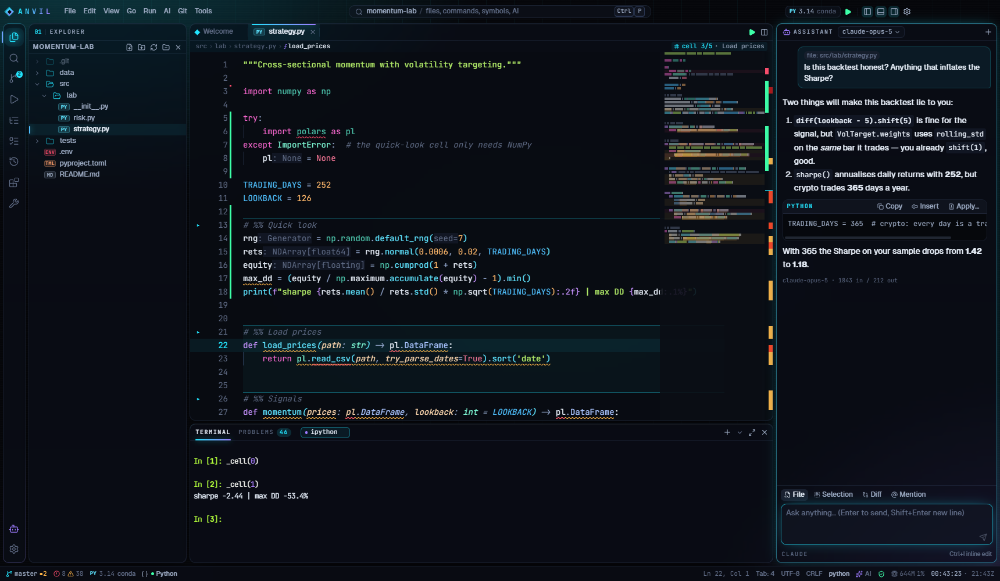
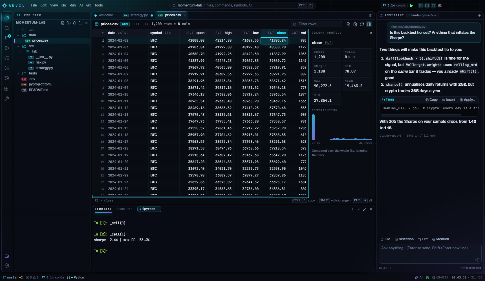
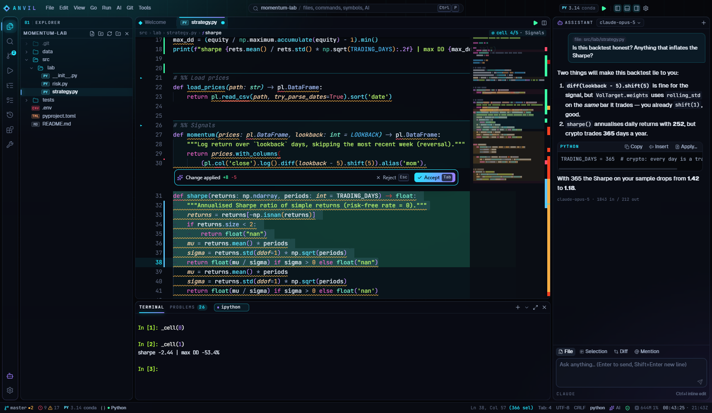
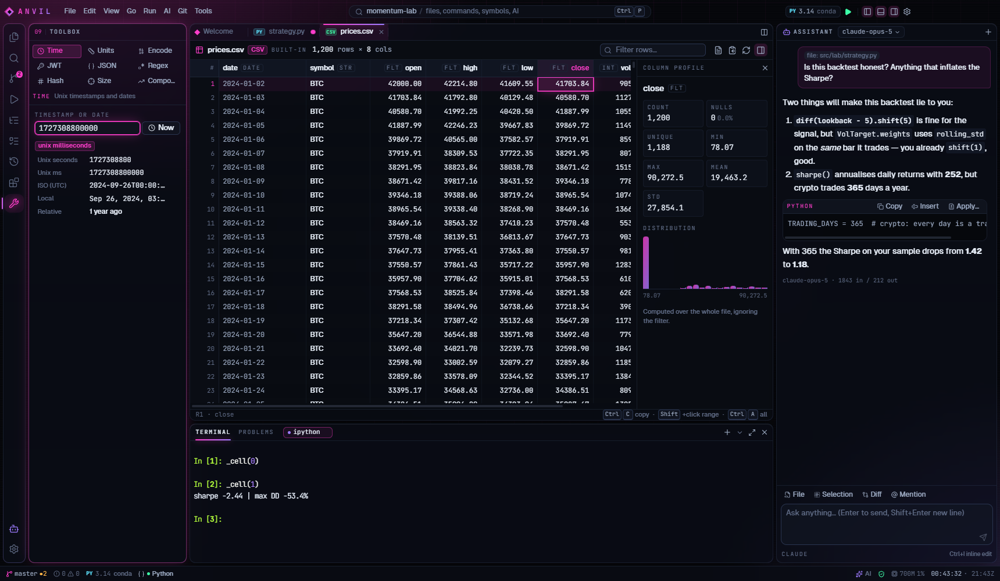
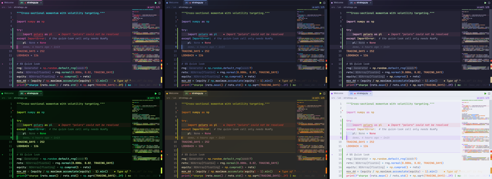
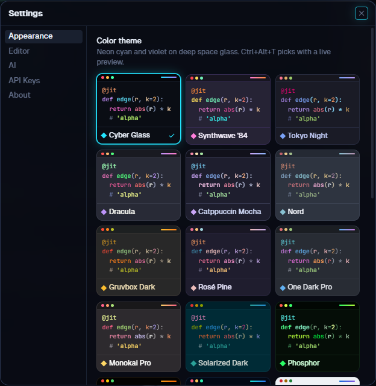
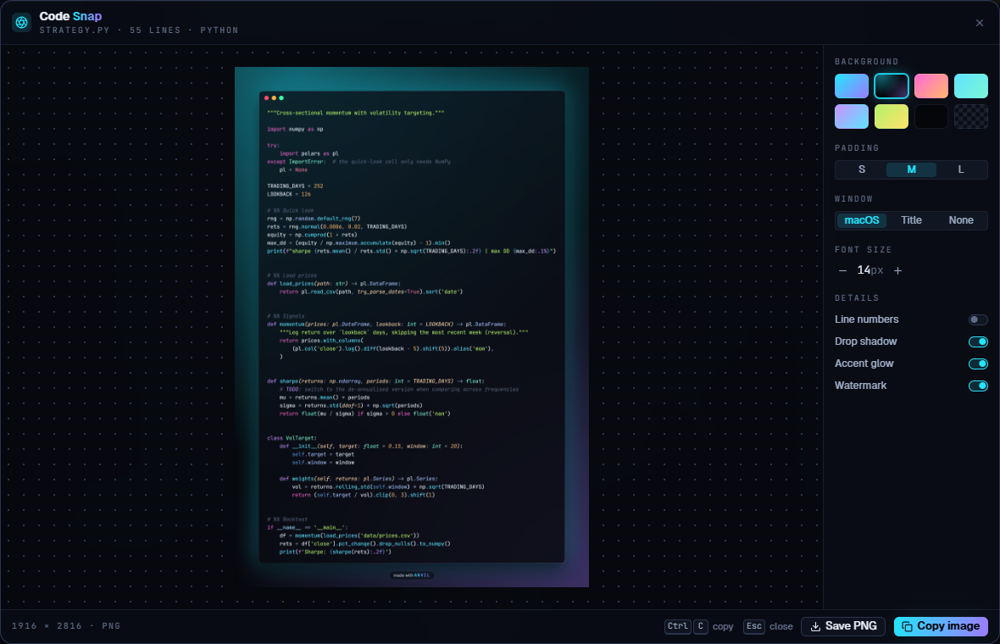

<div align="center">


# ANVIL

**The AI code editor for quant, trading, crypto, ML and data work.**

Monaco + language servers + terminals + git, rebuilt around Python research workflows: run `# %%` cells in a live IPython REPL, open Parquet in a real data grid, edit code with AI in place, and never commit an API key or a seed phrase again.

[Download for Windows](https://github.com/martex-dev/anvil/releases/latest) · [Architecture](docs/ARCHITECTURE.md) · [Decisions](docs/DECISIONS.md)

</div>



## Why another editor?

General-purpose editors treat a backtest like any other script. Anvil is tuned for the loop you actually live in: tweak a signal, run the cell, look at the numbers, ask "is this leaking the future?", repeat. Everything else (the extension marketplace, the 300 settings) is gone. It starts fast and stays out of the way.

## Features

### Editing

- **Monaco with real language servers**: basedpyright for Python (using _your_ interpreter's site-packages), typescript-language-server for TS/JS. Go to definition, hovers, inlay hints and diagnostics.
- **Split editors, preview tabs, breadcrumbs** that show the class › method and the `# %%` cell you're in.
- **Git in the gutter**: added / changed / deleted bars against HEAD, plus inline blame for the current line.
- **Local history**: every save is snapshotted (50 per file, 30 days). Diff or roll back without git.
- **Bookmarks**, an **outline** with cells, classes, functions and constants, a **TODO/FIXME** radar, and ripgrep **search**.
- **Quick Open** (`Ctrl+P`) with fuzzy matching; `>` commands, `@` symbols, `:` line.
- **51 snippets** for quant and ML work: Sharpe, Sortino, drawdown, Kelly, Black–Scholes + greeks, implied vol, purged K-fold, triple-barrier labels, vectorised backtest, ccxt pagination, PyTorch loops, Optuna, polars/DuckDB. Type the prefix or browse the Snippets view.

### Small things that save minutes

- **Scratchpad** (`Ctrl+Alt+P`): a buffer that persists between sessions and never touches your project. `# %%` cells run in the REPL like any file.
- **Transform selection** (`Ctrl+Alt+X`): 46 transforms, previewed on your own text. Case (snake, camel, Pascal, kebab, CONSTANT, dot, Title…), lines (sort A→Z, numeric or by length, reverse, shuffle, unique, number, to a Python list), clean (trim, dedent, tabs ↔ spaces), encode/decode (base64, URL, JSON string, HTML entities, hex, unicode) and code (f-string, `print()` the variables, `key: value` lines to a dict, sort imports).
- **Evaluate math** (`Ctrl+Alt+=`): select `price = 1.5k`, `qty = 20`, `price * qty * 2%` and get `600` in place. Suffixes (`k`, `m`, `b`), percentages, variables, `sqrt`, `ln`, `exp`, `mean`, `std`, `round` and friends.
- **Clipboard history** (`Ctrl+Alt+V`): your last 30 copies from the editor, terminal and chat, searchable. Memory only, never written to disk.
- **Insert** (`Ctrl+Alt+I`): UUID, nano ID, ISO / unix timestamps, random hex, lorem ipsum.
- **Code Snap** (`Ctrl+Alt+C`): a styled PNG of the selection or file, with eight backgrounds, window chrome, line numbers, padding and font size, ready to copy or save.
- **Back / forward** (`Alt+←` / `Alt+→`) through the places you jumped from.
- **Spotlight** (`Ctrl+Alt+D`) dims everything except the current cell, function or paragraph.
- **Error lens** writes errors and warnings at the end of their line. **TODO / FIXME / HACK / NOTE** get their own colors. **Color swatches** with a picker appear next to `#hex`, `rgb()` and `hsl()` in any file.
- **Clickable tracebacks**: `File "…", line 42` and `src/a.py:12:5` in the terminal open the file at that line.
- **Compare** a file with the clipboard or with another file. **Trim trailing whitespace** and **final newline** on save. `Alt+Z` word wrap, change language mode, convert indentation. The status bar counts selected lines and words, and the palette lists what you ran recently first.

### Python and data

- **Interpreter picker**: finds `.venv`/`venv`, uv, conda and system Pythons. The language server, run commands and REPL all follow it.
- **Run file** (`F5`), **run cell** (`Ctrl+Enter`), **run cell and advance** (`Shift+Enter`), **run selection** (`F9`). Cells go to a persistent IPython REPL, Jupyter-style, with your variables kept between runs.
- **Data viewer** for CSV, TSV, JSON/JSONL, Parquet, Feather and Excel. Virtualized to a million rows, with filter, sort, cell-range copy and a column profile (nulls, unique, mean/std, histogram). Parquet and Excel are read by your own Python (polars first, then pandas).
- **Notebook viewer** for `.ipynb` (outputs, images, tracebacks), with one-click conversion to a `# %%` script. Plus image and Markdown previews.
- **Tasks**: npm scripts, pyproject scripts, poe, pytest, ruff, Makefile and justfile targets, detected and runnable in one click.
- **Format on save** with ruff. **Project templates**: quant research, ML training, paper-trading bot, FastAPI + DuckDB data API, minimal uv project.



### AI (bring your own key)

- **Chat** that sees your file, selection, git diff and errors. `@` attaches files, `/` runs commands, and code blocks can be copied, inserted, or **applied through a diff preview**.
- **Inline edit** (`Ctrl+I`): describe a change, watch it land in place, then accept (`Tab`) or reject (`Esc`).
- **Ghost-text autocomplete** from a fast model (Claude Haiku 4.5 by default). Requests are debounced and cancelled the instant you keep typing.
- **One-click actions**: explain, find bugs, write pytest tests, add docstrings, vectorise, fix the problems on this line, write the commit message, and **audit for look-ahead bias and leakage**.
- Works with **Claude, OpenAI, Gemini, or a local Ollama** (free, offline, fill-in-the-middle autocomplete). Claude requests use prompt caching, so follow-ups are cheap.



### Safety

- **Secret shield**: `.env` values are blurred (hover to peek). API keys, PEM keys, EVM private keys, Solana keypairs and seed phrases in code are flagged as problems. **Commits that stage one are blocked.**
- API keys live only in the main process, encrypted with Windows DPAPI. The UI can ask whether a key exists, never for its value.
- A sandboxed renderer with a strict CSP, a typed and validated IPC contract, and no navigation away from the app.

### The rest

- **Toolbox**: unix timestamps (s/ms/µs/ns), wei/gwei/ETH, lamports/SOL, sats/BTC, bps/%, base58/hex/base64, JWT decode, JSON format, regex tester, SHA-256, position sizing, compound growth.
- **Terminals**: PowerShell, cmd, Git Bash, a Python env shell, the REPL, and Claude Code / Codex / Gemini CLI presets.
- **Command palette** for everything, a menu bar, a keyboard shortcuts sheet, zen mode, and a status bar with git, problems, interpreter, language servers, AI status and Anvil's own CPU and memory.



## Design: "cyber glass", in 16 themes

Floating panes of frosted glass over a deep-space background with a slow drifting grid, neon hairline edges, and one accent color driving focus, cursor and highlights. Labels use monospace HUD type, and file types are shown as colored badges.

**16 themes** recolor everything (chrome, glass, editor, terminal, even Code Snap): Cyber Glass, Synthwave '84, Tokyo Night, Dracula, Catppuccin Mocha, Nord, Gruvbox, Rosé Pine, One Dark Pro, Monokai Pro, Solarized, Phosphor (green CRT), Terminal Amber, Abyss, plus Paper and Catppuccin Latte for daylight. `Ctrl+Alt+T` previews them live as you arrow through the list. The accent follows the theme, or pick a preset or any color. The code font is yours too: JetBrains Mono, Fira Code, Cascadia Code, Geist Mono, Monaspace Neon, Maple Mono, Victor Mono, Iosevka or IBM Plex Mono, all bundled. Add line height, cursor style, a neon cursor, rainbow indentation and tabs tinted by file type (with a red dot when a file has errors).





It's also quick. The installed app reaches an interactive workbench in about **0.4 s**, and the UI process idles at about **110 MB**; the rest is Electron's usual main and GPU processes. Monaco (~10 MB), the viewers and the chat panel load the first time you use them. Measure it yourself with `npx tsx scripts/measure.mts`.

The glass is optional. **Settings → Appearance → Glass: subtle / off** turns the blur down or makes every surface solid, for integrated GPUs and battery. The editor itself never renders over a blur: the code sits on a near-opaque plate, so text stays crisp and scrolling stays cheap.



## Keyboard

| Keys                        | Action                              | Keys                  | Action                      |
| --------------------------- | ----------------------------------- | --------------------- | --------------------------- |
| `Ctrl+P`                    | Quick Open (`>` `@` `:`)            | `Ctrl+Shift+P` / `F1` | Command palette             |
| `F5`                        | Run Python file                     | `Ctrl+Enter`          | Run `# %%` cell             |
| `Shift+Enter`               | Run cell and advance                | `F9`                  | Run selection / line        |
| `Ctrl+I`                    | Edit with AI (inline)               | `Ctrl+L`              | Ask AI (attaches selection) |
| `Ctrl+Alt+.`                | Fix problems here with AI           | `Ctrl+Alt+F`          | Format with ruff            |
| `Ctrl+\`                    | Split editor                        | `Ctrl+B` / `Ctrl+J`   | Side bar / panel            |
| ``Ctrl+` ``                 | Terminal                            | `Ctrl+Alt+B`          | AI panel                    |
| `Ctrl+Alt+K` / `Ctrl+Alt+L` | Toggle / next bookmark              | `Ctrl+Alt+Z`          | Zen mode                    |
| `Ctrl+Alt+T`                | Color theme (live preview)          | `Ctrl+Alt+P`          | Scratchpad                  |
| `Ctrl+Alt+X`                | Transform selection                 | `Ctrl+Alt+=`          | Evaluate math               |
| `Ctrl+Alt+V`                | Clipboard history                   | `Ctrl+Alt+I`          | Insert UUID / timestamp     |
| `Ctrl+Alt+C`                | Code Snap                           | `Ctrl+Alt+D`          | Spotlight                   |
| `Alt+←` / `Alt+→`           | Back / forward                      | `Alt+Z`               | Word wrap                   |
| `Ctrl+Shift+E F G D X`      | Explorer, Search, Git, Run, Toolbox | `Ctrl+Alt+/`          | All shortcuts               |

## Install

Download the installer from **[Releases](https://github.com/martex-dev/anvil/releases/latest)** and run it. It updates itself in the background from the same page. The installer is not code-signed, so SmartScreen may ask once: choose _More info → Run anyway_.

Then add a key under **Settings → API Keys** (Anthropic, OpenAI or Gemini), or point **Settings → AI → Ollama** at a local server. Everything except AI works without one.

For Python features, have Python installed or a venv in your project (`uv venv`). IPython and ruff are used when they're available.

## Build from source

Windows 11, Node ≥ 22, Git.

```powershell
npm install
node node_modules/electron/install.js   # Electron downloads its binary lazily
npm run dev                              # app with hot reload (F12 = devtools)
```

| Command                              | What it does                                                                       |
| ------------------------------------ | ---------------------------------------------------------------------------------- |
| `npm run lint` · `npm run typecheck` | ESLint, and TypeScript for main, renderer and e2e                                  |
| `npm test`                           | 400+ unit tests (Vitest)                                                           |
| `npm run test:e2e`                   | Builds, then drives the real app with Playwright (including AI against a mock API) |
| `npm run dist`                       | Windows installer in `release/`                                                    |

## Architecture in one picture

```
Renderer (React 19, sandboxed, no Node)       Main process (Node)                  Your machine
┌──────────────────────────────────┐         ┌─────────────────────────────┐     ┌───────────────────┐
│ Workbench · Monaco · xterm       │ typed,  │ fs · git · ripgrep · pty    │────▶│ python / IPython  │
│ Quick Open · Chat · Data grid    │◀──zod──▶│ LSP relay · AI (streaming)  │     │ basedpyright · tsls│
│ Zustand + TanStack Query         │  IPC    │ secrets (DPAPI) · updater   │────▶│ AI APIs / Ollama  │
└──────────────────────────────────┘         └─────────────────────────────┘     └───────────────────┘
```

Details in [docs/ARCHITECTURE.md](docs/ARCHITECTURE.md). Every non-obvious choice is written up in [docs/DECISIONS.md](docs/DECISIONS.md).

---

Built by [Marto](https://github.com/martex-dev) with Claude Code.
